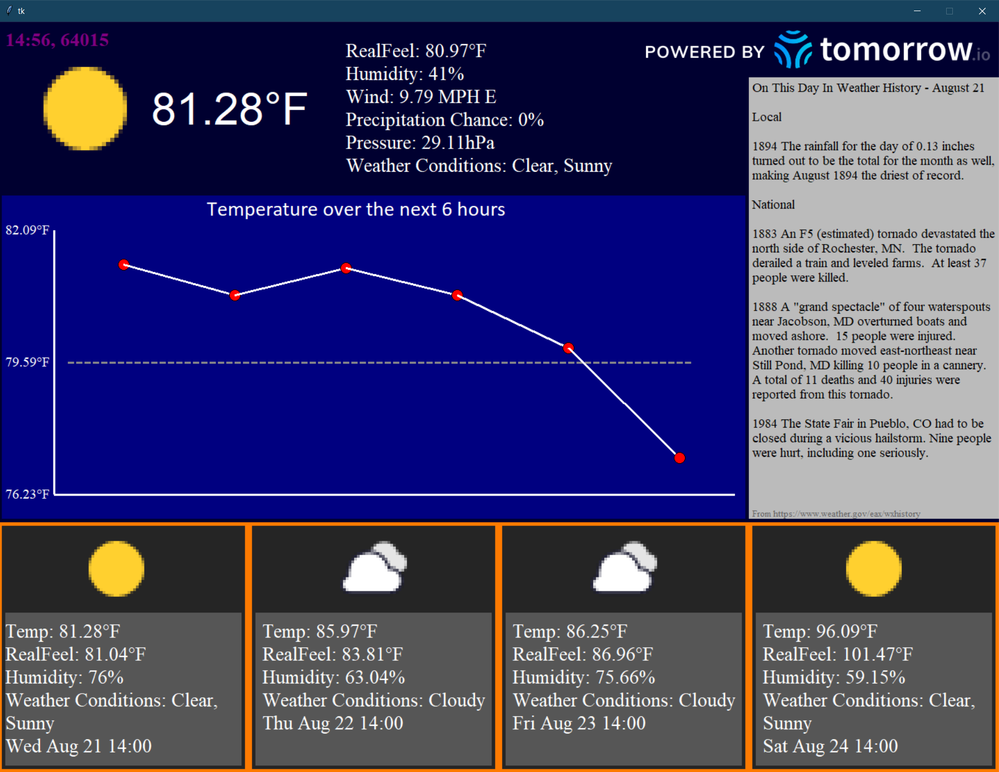

# WeatherGUI
Python-based GUI app for weather built from Tkinter.

# Current Weather
There is a screen containing current weather data pulled from [tomorrow.io](https://www.tomorrow.io/). This data includes temperature, wind, humidity, precipitation, etc.

# Forecast
There will be a container at the bottom of the screen that displays the forecast for the next 4 days at the current hour.

# Weather History
On the right side of the screen will reside a container for historical facts about the weather on the current day. For example, May 20 could have notes about the Moore, Oklahoma tornado from 2013. There could be highest/lowest temperatures on record for the day or any other historical data. This is a blank canvas for information that can be determined later. This data comes from https://www.weather.gov/eax/wxhistory

# Example from zip code 64015

